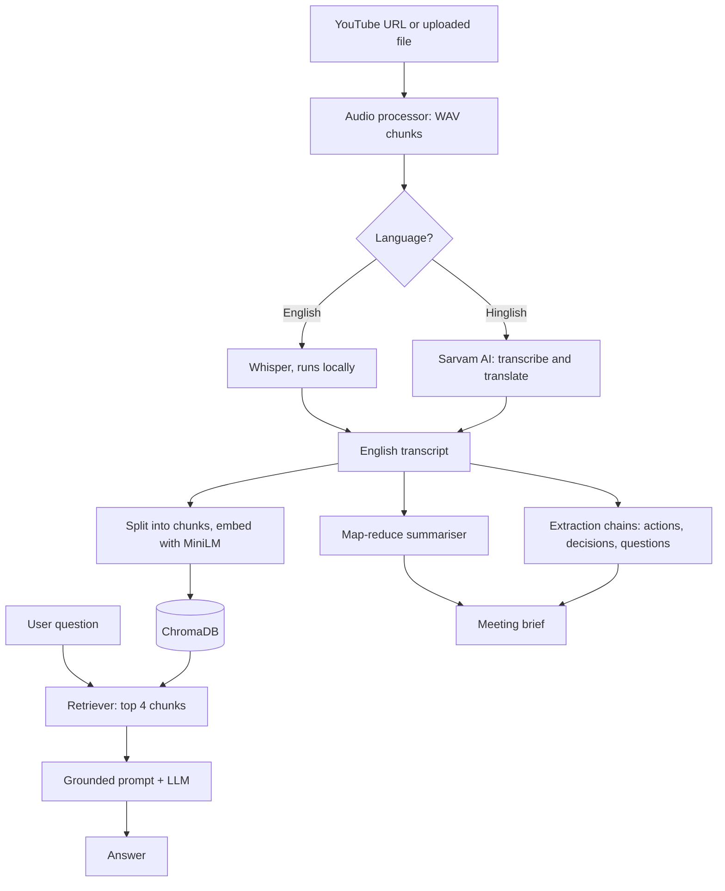

# AI Meeting Assistant

Turn a meeting recording into a structured brief, then chat with the transcript.

Give it a YouTube link or an audio/video file. It transcribes the speech, summarises the meeting, extracts action items, decisions and open questions, and builds a **Retrieval-Augmented Generation (RAG)** index so you can ask questions and get answers grounded in what was actually said.

The project is a pipeline of **LangChain (LCEL) chains** around a free-tier LLM, with a local vector store for retrieval. A Streamlit app and a command-line script both sit on top of the same core modules.

---

## What it does

| Capability | How it is done |
|---|---|
| Speech to text | Local **Whisper** for English. **Sarvam AI** for Hinglish, which transcribes and translates to English in one step. |
| Meeting summary | **Map-reduce summarisation** with an LCEL chain, so long meetings fit the model's context window. |
| Structured extraction | Three prompt-engineered chains return action items (task, owner, deadline), key decisions and open questions. |
| Chat with the meeting | **RAG**: transcript chunks are embedded into **ChromaDB**, the top matches are retrieved per question, and the LLM answers using only that context. |
| Export | PDF or TXT of the full brief (in the UI). |

---

## Architecture



---

## How each stage works

### 1. Audio ingestion
`utils/audio_processor.py` takes a YouTube URL or a local file and produces a list of WAV chunks. Chunking keeps each transcription call small and lets long recordings be processed piece by piece.

### 2. Transcription and translation
`core/transcriber.py` routes every chunk by language:

| Choice | Engine | What happens |
|---|---|---|
| `english` | Whisper (`small` by default), local | `task="transcribe"` on the chunk. |
| `hinglish` | Sarvam AI `speech-to-text-translate` | Hindi/English mixed speech comes back as English text. |

Sarvam's synchronous API accepts at most 30 seconds of audio, so each chunk is cut into 25-second pieces, sent one at a time, and the results are joined. Whatever the language, the rest of the pipeline only ever sees an **English transcript**.

### 3. Summarisation (map-reduce)
`core/summarizer.py`

1. **Split** the transcript with `RecursiveCharacterTextSplitter` (3000 characters, 200 overlap).
2. **Map**: summarise every chunk independently.
3. **Reduce**: combine the partial summaries into one professional, bullet-point meeting summary.

A separate short chain writes the **meeting title** from the first 2000 characters.

### 4. Structured extraction
`core/extractor.py` runs three single-purpose chains. Each is a system prompt that sets an analyst role and an exact output format, followed by the transcript:

- **Action items**: task, owner, and deadline (or "Not specified"), as a numbered list.
- **Key decisions**: numbered list.
- **Open questions**: unresolved topics needing follow-up, as a numbered list.

Each prompt also states what to reply when nothing is found, which keeps the output predictable. Temperature is 0 for stable, repeatable extraction.

### 5. RAG chat
`core/vector_store.py` and `core/rag_engine.py`

**Indexing**
1. Split the transcript into small chunks: `RecursiveCharacterTextSplitter`, 500 characters, 50 overlap.
2. Embed each chunk with `all-MiniLM-L6-v2` (runs on CPU through HuggingFace).
3. Store the vectors in **ChromaDB**, persisted in `vector_db/`. Each chunk keeps a `chunk_index` in its metadata.

**Retrieval and generation** (a single LCEL chain):

```python
rag_chain = (
    {"context": retriever | RunnableLambda(format_docs),
     "question": RunnablePassthrough()}
    | prompt | llm | StrOutputParser()
)
```

The retriever returns the four most similar chunks. They are joined into one context block and passed to a **grounded prompt** that tells the model to answer only from that context. If the answer is not there, it must say so instead of guessing:

> "I could not find this information in the meeting transcript."

| Setting | Value | File |
|---|---|---|
| Embedding model | `all-MiniLM-L6-v2` | `vector_store.py` |
| Vector store | ChromaDB, collection `meeting_transcript` | `vector_store.py` |
| Chunk size / overlap | 500 / 50 characters | `vector_store.py` |
| Search | Similarity, top 4 | `vector_store.py`, `rag_engine.py` |
| LLM | OpenRouter free-model router (`openrouter/free`), temperature 0 | `rag_engine.py` |

### Generative AI techniques used

| Technique | Where |
|---|---|
| LCEL chain composition (`prompt \| llm \| parser`) | Every core module |
| Role and format prompting | `extractor.py`, `summarizer.py` |
| Map-reduce summarisation | `summarizer.py` |
| Retrieval-Augmented Generation | `vector_store.py`, `rag_engine.py` |
| Dense embeddings and vector similarity search | `vector_store.py` |
| Grounded generation with a refusal fallback | `rag_engine.py` |
| Deterministic decoding (temperature 0) | All LLM calls |
| Multi-engine speech-to-text routing | `transcriber.py` |

---

## Tech stack

| Layer | Tools |
|---|---|
| LLM orchestration | LangChain, LCEL |
| LLM | OpenRouter (`langchain-openrouter`, model `openrouter/free`) |
| Speech to text | OpenAI Whisper (local), Sarvam AI (Hinglish) |
| Embeddings | HuggingFace `sentence-transformers`, `all-MiniLM-L6-v2` |
| Vector database | ChromaDB |
| Audio handling | FFmpeg, pydub |
| Interface | Streamlit app and CLI |

---

## Project structure

```
.
├── app.py                  # Streamlit interface
├── main.py                 # CLI entry point and run_pipeline()
├── core/
│   ├── transcriber.py      # Whisper / Sarvam routing
│   ├── summarizer.py       # Map-reduce summary + title
│   ├── extractor.py        # Action items, decisions, open questions
│   ├── vector_store.py     # Chunking, embeddings, ChromaDB
│   └── rag_engine.py       # RAG chain and ask_question()
├── utils/
│   └── audio_processor.py  # Input handling and audio chunking
├── vector_db/              # ChromaDB files (created at runtime)
├── requirements.txt
└── .env                    # API keys (not committed)
```

---

## Getting started

### Prerequisites
- Python 3.10 or newer
- **FFmpeg** installed and on your `PATH`
  - Windows: `winget install ffmpeg`
  - macOS: `brew install ffmpeg`
  - Ubuntu: `sudo apt install ffmpeg`

### Install

```bash
python -m venv .venv
source .venv/bin/activate        # Windows: .venv\Scripts\activate
pip install -r requirements.txt
```

### Configure

Create a `.env` file in the project root:

```env
OPENROUTER_API_KEY=your_openrouter_key

# Only needed for Hinglish audio
SARVAM_API_KEY=your_sarvam_key

# Optional
WHISPER_MODEL=small              # tiny, base, small, medium, large
SARVAM_STT_MODEL=saaras:v2.5
```

### Run

```bash
# Command line: brief plus a chat loop in the terminal
python main.py

# Web interface
streamlit run app.py
```

---

## Configuration reference

| What to change | Where |
|---|---|
| Whisper model size | `WHISPER_MODEL` in `.env` |
| LLM model or temperature | `get_llm()` in `extractor.py`, `summarizer.py`, `rag_engine.py` |
| Summary chunk size | `split_transcript()` in `summarizer.py` |
| RAG chunk size and overlap | `build_vector_store()` in `vector_store.py` |
| Number of retrieved chunks | `k` in `build_rag_chain()` in `rag_engine.py` |
| Embedding model | `EMBEDDING_MODEL` in `vector_store.py` |
| Answer style and refusal rule | System prompt in `rag_engine.py` |

---

## Privacy: what leaves your machine

| Data | Sent to | When |
|---|---|---|
| English audio | Nowhere. Whisper runs locally. | Always |
| Hinglish audio | Sarvam AI | Hinglish selected |
| Transcript text | OpenRouter | Summary, extraction and every chat question |
| Embeddings and vector index | Nowhere. Local MiniLM and ChromaDB. | Always |

Free-tier LLM providers may log or use prompts, so avoid confidential recordings unless you have checked the provider's terms.

---

## Limitations and roadmap

**Current limitations**
- **The chat has no memory.** Each question is answered on its own, so follow-ups like "explain that more" do not work.
- **Broad questions retrieve poorly.** Four 500-character chunks cannot represent a whole meeting, so questions such as "what were the main topics?" are better answered by the summary.
- **Extraction sends the entire transcript in one call.** Very long meetings can exceed a free model's context window.
- **Free-tier rate limits.** The map step makes one LLM call per 3000-character chunk, one after another, and a free model can return HTTP 429.
- **The free router varies.** `openrouter/free` may pick a different model on each request, so output formatting can drift.
- **No speaker labels or timestamps.** Diarisation is switched off, so the transcript does not say who spoke.
- **The embedding model is English-only in practice.** This is fine because everything is translated to English first.

**Ideas for next steps**
- History-aware retriever so follow-up questions are rewritten into standalone ones
- Show the retrieved chunks (the `chunk_index` metadata is already stored) as answer sources
- Structured output with Pydantic models for action items (`with_structured_output`)
- Map-reduce extraction for long transcripts, with retries and rate limiting
- MMR or hybrid (keyword plus vector) retrieval, and a larger `k` for broad questions
- RAG evaluation with a small question set and a tool such as RAGAS
- Speaker diarisation

---

## License

Add your license here.
